# Group1 Assignment
For HCIN720 Group Assignment

## A description of the display, including pictures: 
 - Description of the display: Use [Magnetic Ferrofluid](http://www.amazon.com/gp/product/B008H40LG4?psc=1&redirect=true&ref_=oh_aui_detailpage_o01_s00) to display the due day from google calendar 
   1. The Wooden box: The box contains electrics and wires. Two layers of wood board are used to make the case to sustain the structure. 3D printed parts are screwed inside the box, holding the motor, magnets, Photon and other components.
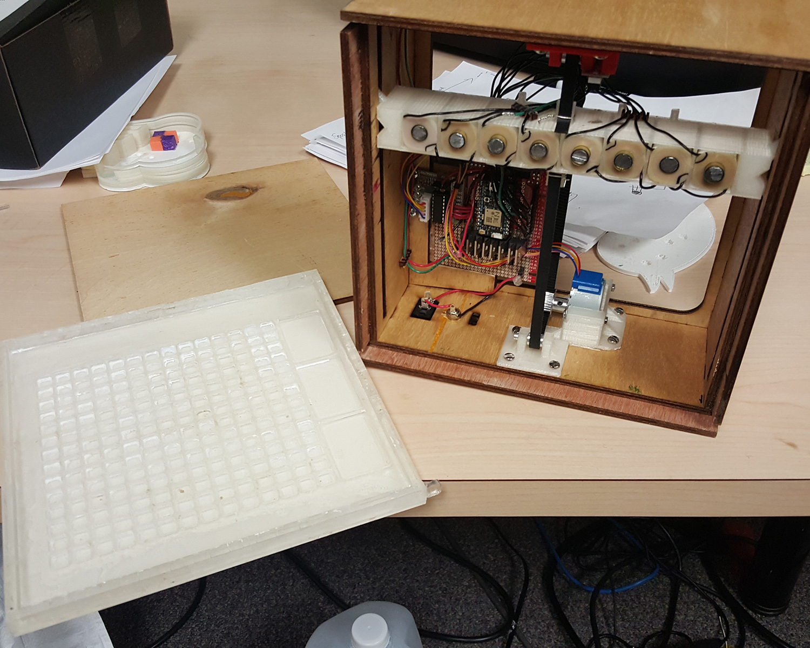
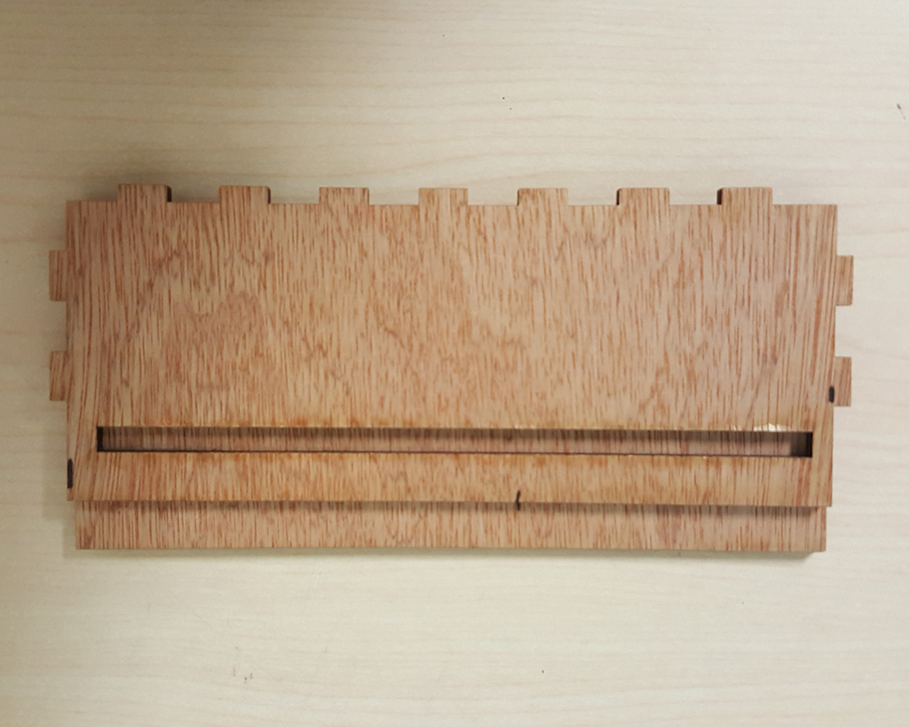
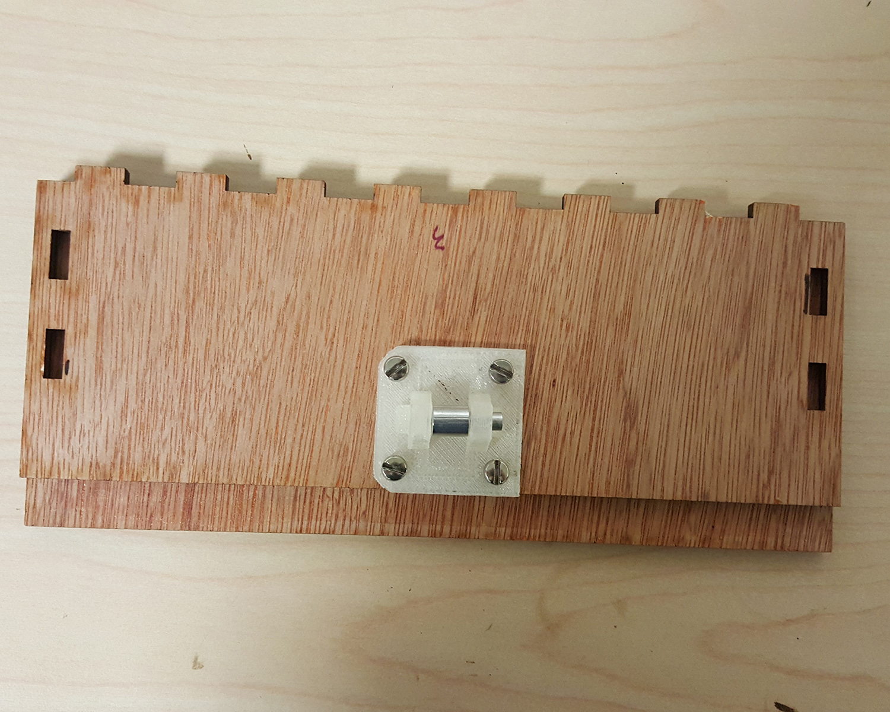
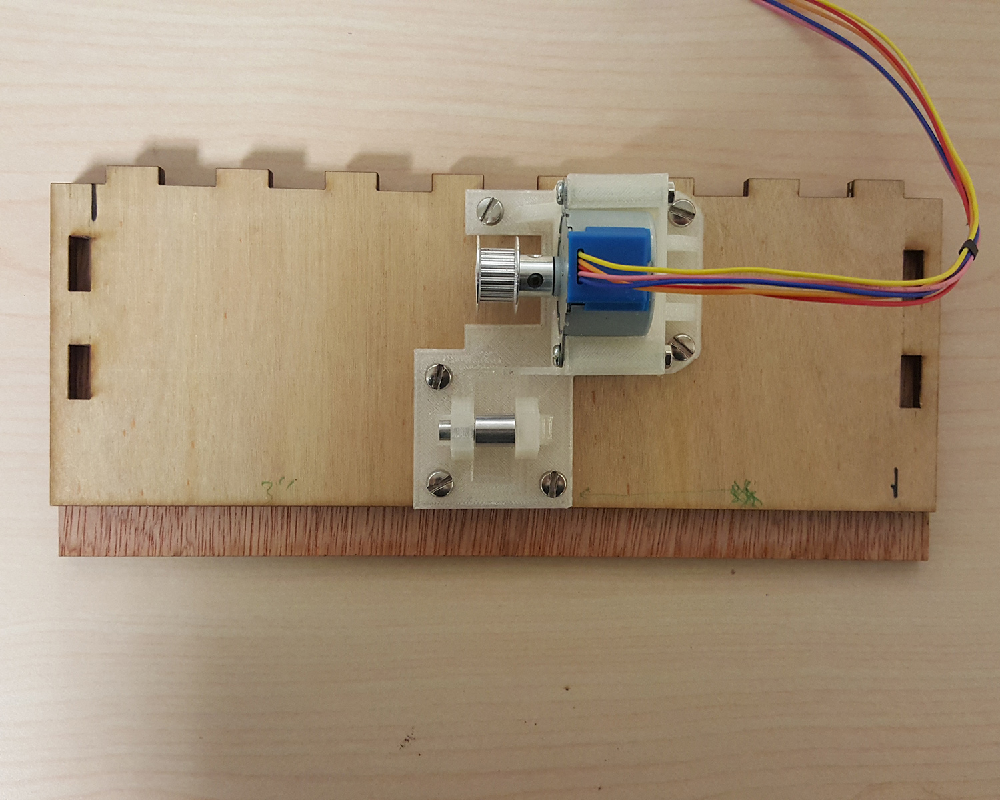
 
   2. Acrylic as basic container: We use Laser-cut acrylic as the container for the Ferrofluid. It has two layers, the first layer have a matrix (14*14) of holes and 3 big holes. The 14*14 matrix is used for display the number of days before the due day. 3 big holes act as storage for Ferrofluid. When there is a new calendar event created, Electromagnet will pull Magnetic Ferrofluid out from big holes into the matrix. Each small hole presents one more day left before the due.
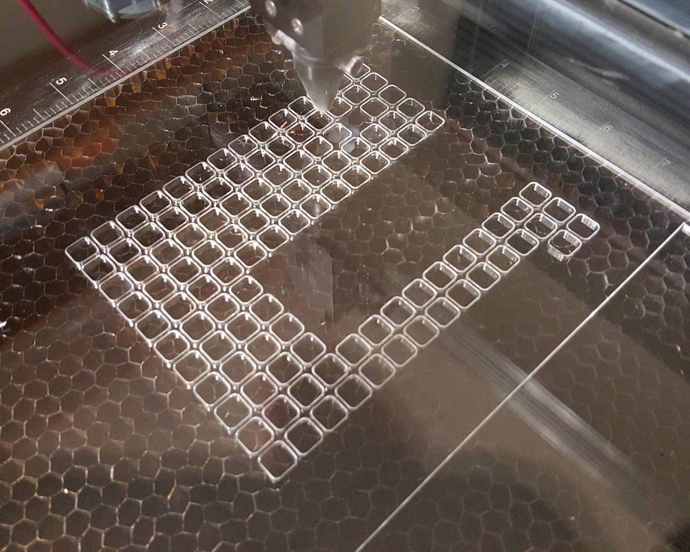 

   3. Aluminum cover on the top of acrylic: There is a layer of aluminum covering the acrylic to prevent acrylic from reaction to the solvent(Isopropyl alcohol).  
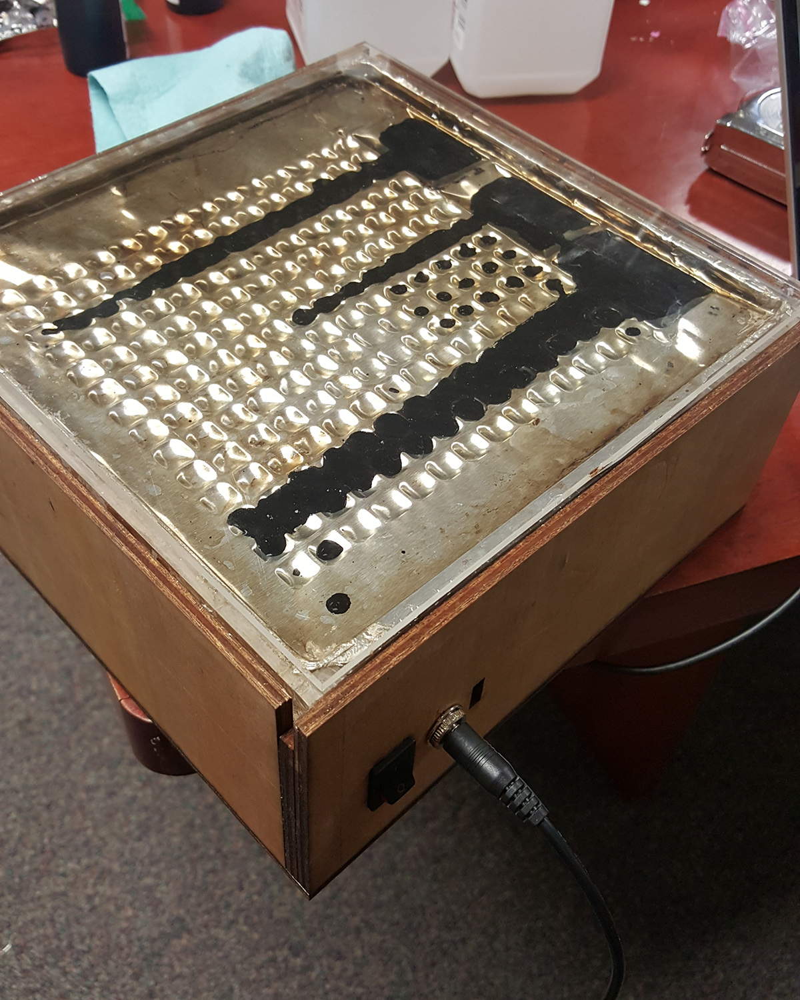 

   4. Ferrofluid moving mechanism: There is an row of electromagnets, which pull the Ferrofluid out from the big tanks and fill appropriate small puddles. The motor is fixed on the side of the box to move the electromagnet carriage. The carriage will move to a specific location in order to create a new partten in the reservoir. 

   5. Circuit: We use P-channel MOSFETs to control the  5 volts driving power with the Photon's logic level signals. Diodes are also introduced to protect the circuit from induced current.
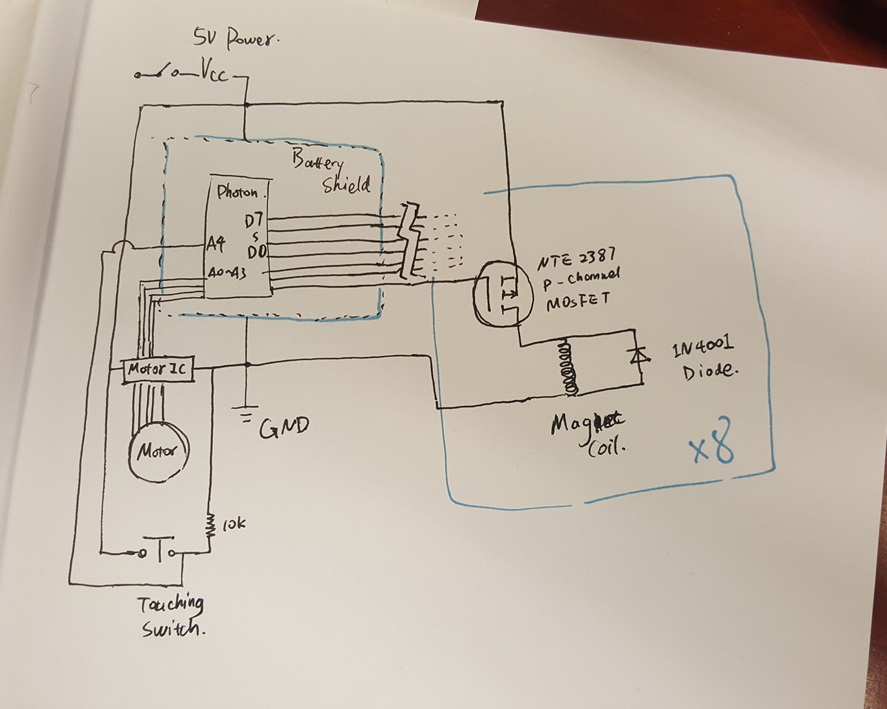
 

   6. summery: When you update one event on your google calendar, this display will probably changed based on its due day. It only contain event which is happened in 14 days, since there are only 14 hole a row. Everytime, this display only show most recent 3 events, according to the number of big holes.
   7. About the Ferrofluid and the container: We tried many combinations to create a stable container-liquid environment which the ferrofluid stays flexible and doesn't stick to anything else. But due to the limitation of time, money and our chemical knowledge, we are not able to make a satisfying container. This could be fixed if we later consult with the chemistry department of RIT.
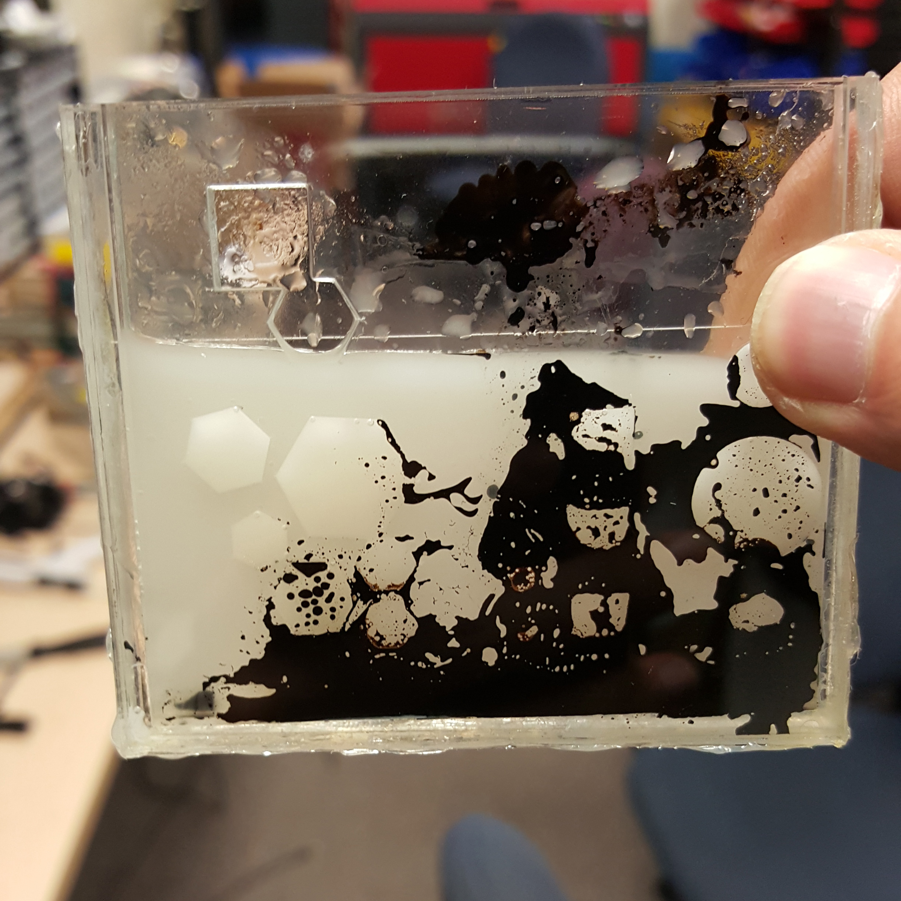
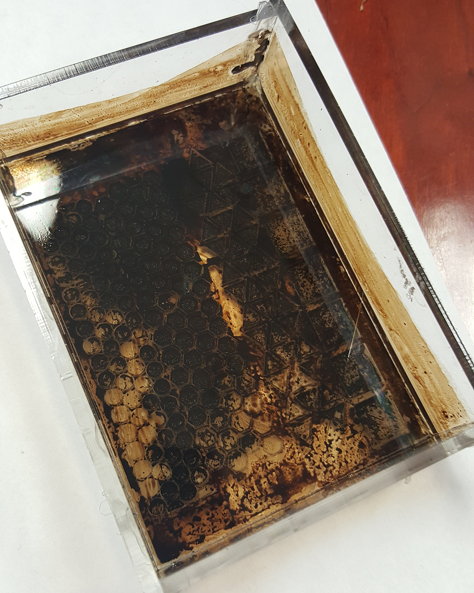
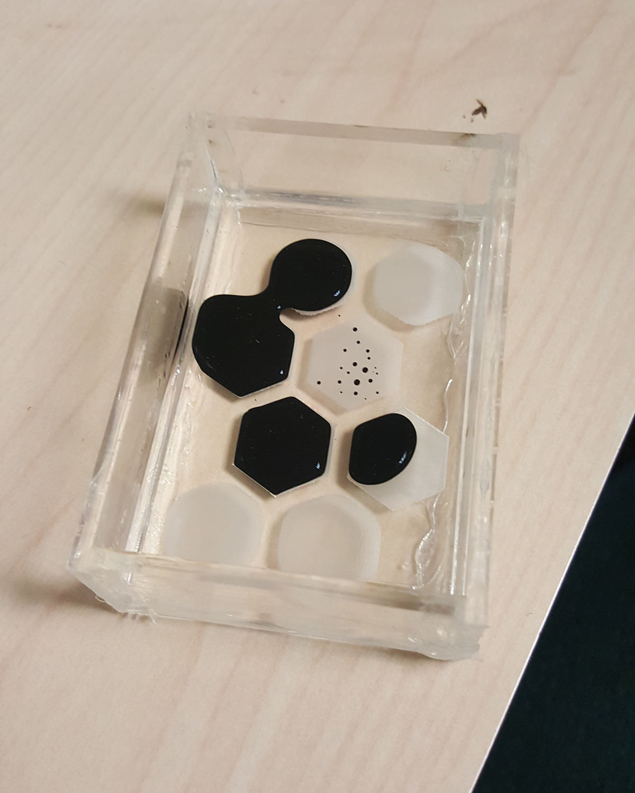
 
## what choices you made for the information to display and the way you displayed it
 - choices made for information to display: 
   The most recent 14 days event 
   Only 3 events will be showing on the display 
 - The way displayed it: For each event, Magnetic Ferrofluid will be pull out to filled one row of small holes. The number of holes be filled present how many days left 
 
 - Here are some of our design sketches.
 - 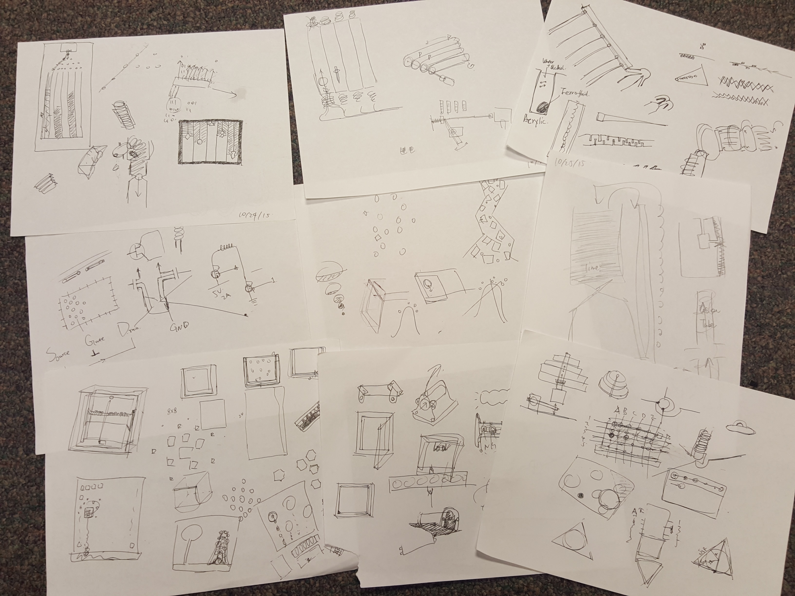

## Previous Research
 [SnOil](http://www.freymartin.de/en/projects/snoil) and [Ferriolic](http://www.ferrolic.com/) are two exmaples we found after we decided to work with Ferrofulid and electricmagent. We are trying to build our display with more flexbility and practicability than the predecessors that a clear image can stay with almost no power comsumption meanwhile we can change certain ferrofluid drop easily. We have confidence to believe that our work will be better in performance if we find the right solution-container combination. 
 

## source code and 3D/2D model files
 - The photon code in the photon folder, The GoogleCalendar code in googlecalendar foloer 
 - All the 3D and 2D model in the model foler
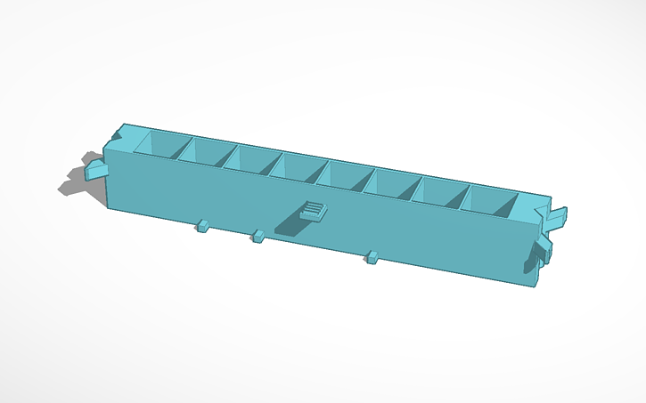
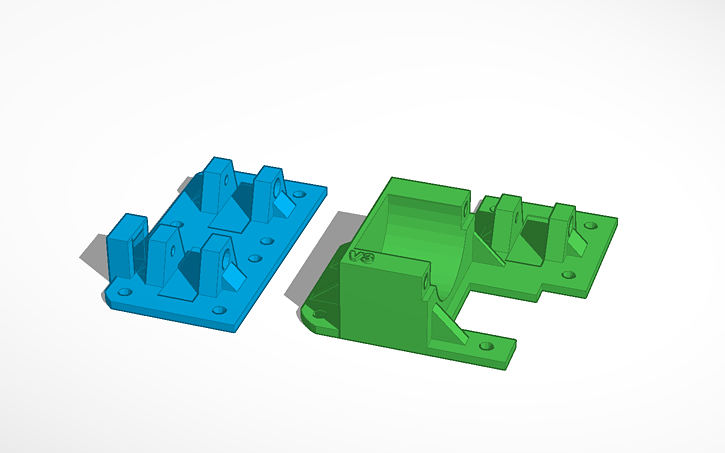
 

